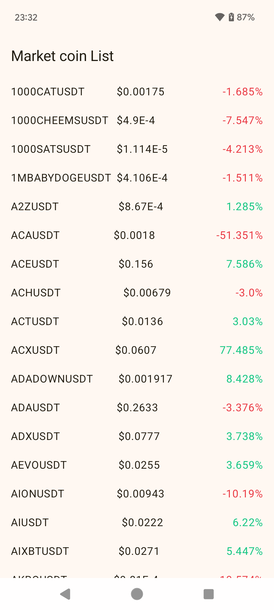
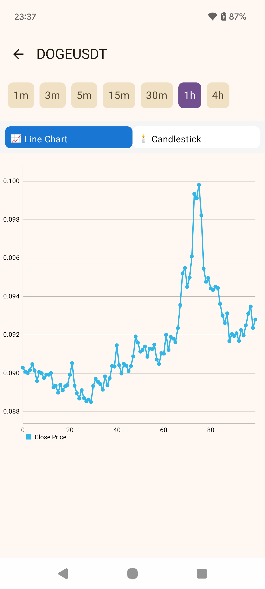
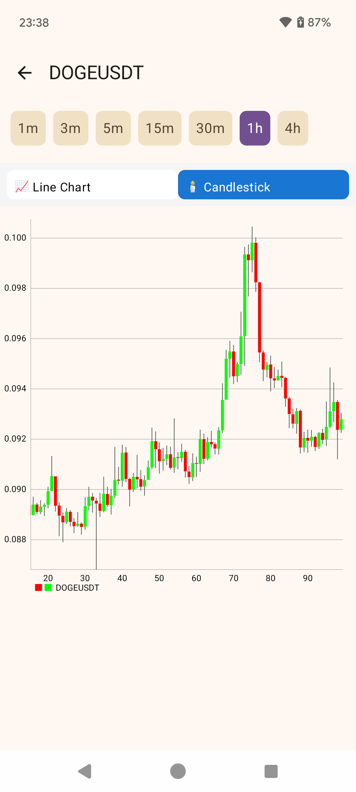

# Crypto Market Tracker

A modern Android app for tracking cryptocurrency prices in real time using the Binance API.

Built with Jetpack Compose, Clean Architecture, Paging3, Room caching, and WebSocket realtime updates using an offline-first data architecture.

---

# Screenshots

| Market List | Line Chart | Candlestick |
|-------------|-------------|----------------|
|  |  |  |

---

# Features

- Realtime crypto price updates via Binance WebSocket
- Market list with 24h price change
- Candlestick price chart
- Multiple chart intervals (1m, 3m, 5m, 15m, 1h, 4h)
- Offline cache with Room database
- Efficient list rendering using Paging3
- Modern UI built with Jetpack Compose 

---

# Data Flow

The database acts as the **single source of truth**.

Realtime flow:
```
WebSocket
    ↓
Repository
    ↓
Room update
    ↓
PagingSource
    ↓
Compose UI recomposition
```
---

# Tech Stack

- Kotlin
- Jetpack Compose
- Clean Architecture
- MVVM
- Retrofit
- Room Database
- Paging3
- Hilt
- Kotlin Coroutines / Flow
- Binance REST API
- Binance WebSocket

---

# Project Structure
```
data
├─ remote
│ ├─ api
│ └─ model
├─ websocket
├─ local
│ └─ room
└─ repository

domain
├─ model
├─ repository
└─ usecase

presentation
├─ market
└─ chart
```
---

# Author

Luong Ho  
Android Developer